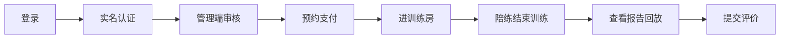
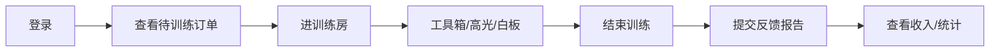
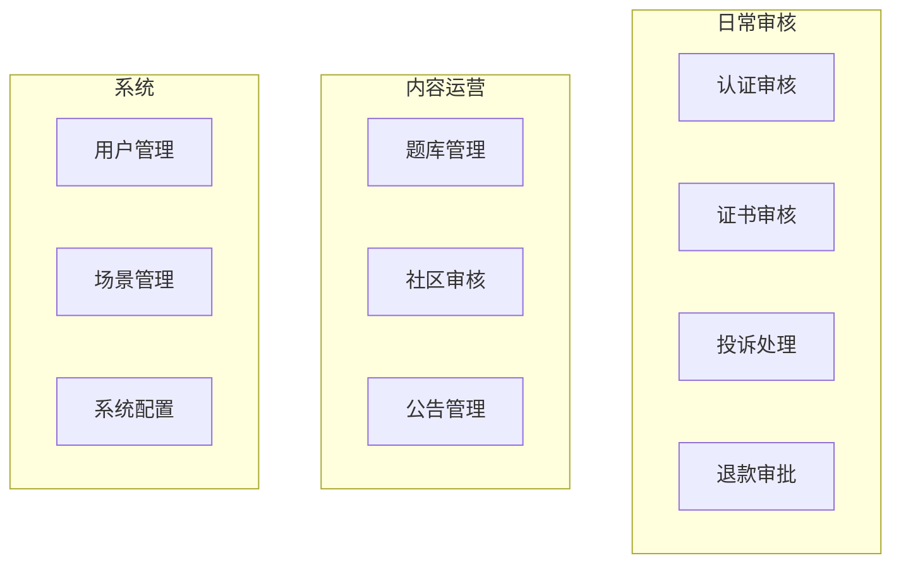

# 语境智练 · 项目运行说明书

<<<<<<< HEAD
> 本文档说明如何在本地/演示环境**启动项目**，以及**学员端、陪练端、管理端**的完整使用流程。  
> 面向：测试、演示、新成员上手、课程答辩展示。

---

## 目录

1. [运行前准备](#1-运行前准备)
2. [统一登录与三端入口](#2-统一登录与三端入口)
3. [学员端使用流程](#3-学员端使用流程)
4. [陪练端使用流程](#4-陪练端使用流程)
5. [管理端使用流程](#5-管理端使用流程)
6. [跨端联合演示（推荐剧本）](#6-跨端联合演示推荐剧本)
7. [配图说明](#7-配图说明)
8. [常见问题](#8-常见问题)

---

## 1. 运行前准备

### 1.1 环境要求

| 依赖 | 版本建议 |
|------|----------|
| JDK | 17+ |
| Maven | 3.8+ |
| Node.js | 18+ |
| MySQL | 8.0（库名 `context_practice`） |
| Redis | 本地运行，建议设密码 |

### 1.2 后端配置与启动

```bash
cd ContextPractice-backend
copy .env.example .env    # 填入 MySQL / Redis / TRTC 等（开发可只填数据库）
mvn spring-boot:run
```

启动成功后访问：**http://localhost:8080**

> Flyway 会自动执行数据库迁移（V1–V11），首次启动需确保 MySQL 已创建空库 `context_practice`。

### 1.3 三端前端启动

在**三个终端**分别执行：

```bash
# 终端 A：学员端 H5
cd ContextPractice-frontend
npm install
npm run dev:h5
# → http://localhost:5173

# 终端 B：陪练端
cd ContextPractice-coach
npm install
npm run dev
# → http://localhost:5175

# 终端 C：管理端
cd ContextPractice-frontend
npm run dev:admin
# → http://localhost:5176
```

### 1.4 端口一览

| 服务 | 地址 | 说明 |
|------|------|------|
| 后端 API | http://localhost:8080 | 所有前端 `/api` 代理到此 |
| 学员端 | http://localhost:5173 | uni-app H5 |
| 陪练端 | http://localhost:5175 | 独立 PC Web |
| 管理端 | http://localhost:5176 | admin 子应用 |

> **[配图建议：图 1-1 四窗口联调布局]**  
> 截图桌面同时打开 5173 / 5175 / 5176 三个浏览器标签 + 可选 Postman/终端，标注「先启后端，再启三端」。

### 1.5 演示账号

开发环境短信验证码固定为 **888888**（无需真实短信）。

| 角色 | 手机号 | 用户名 | 说明 |
|------|--------|--------|------|
| 学员 | 13800000001 | demo_user | 主演示学员 |
| 陪练 | 13800000002 | demo_coach | 接单、进房、提交证书 |
| 管理员 | 13800000003 | demo_admin | 审核与运营 |

备用学员（多种子订单）：13800000011~13、13800000021~23。

---

## 2. 统一登录与三端入口

三端共用学员端登录页，通过顶部切换进入不同端。

### 2.1 打开登录页

浏览器访问：

```
http://localhost:5173/#/pages/auth/login
```

也可带参数直达目标端：

| URL 参数 | 效果 |
|----------|------|
| `?side=user` | 默认学员端（登录后进 Tab 首页） |
| `?side=coach` | 陪练端（登录后跳转 5175） |
| `?side=admin` | 管理端（登录后跳转 5176） |

### 2.2 登录步骤（通用）

1. 在登录页顶部选择 **学员端 / 陪练端 / 管理端** 之一。
2. 输入对应演示手机号（见上表）。
3. 点击「获取验证码」→ 输入 **888888**（开发环境页面可能直接提示 dev 码）。
4. 点击「登录」。
5. 系统按角色自动跳转：
   - **学员** → 留在 5173 首页
   - **陪练** → `http://localhost:5175/#/orders?token=...`
   - **管理员** → `http://localhost:5176/#/dashboard?token=...`

> **[配图建议：图 2-1 统一登录页三端切换]**  
> 截取登录页顶部「学员端 / 陪练端 / 管理端」切换区域 + 手机号/验证码表单。

### 2.3 退出登录

| 端 | 操作 |
|----|------|
| 学员端 | 我的 → 设置相关入口，或清除浏览器缓存后访问 `?logout=1` |
| 陪练端 | 侧栏底部退出，或 token 失效后回登录页 |
| 管理端 | 左侧栏底部「退出登录」 |

---

## 3. 学员端使用流程

**访问地址**：http://localhost:5173  
**演示账号**：13800000001 / 888888

底部 Tab：**首页 · 场景 · 实战圈 · 订单 · 我的**

---

### 3.1 流程 A：实名认证（预约前必做）

> 预约专家陪练前需完成实名认证；未认证会弹窗引导。

| 步骤 | 操作 | 页面 |
|------|------|------|
| 1 | Tab「我的」→ 个人看板 → **身份认证** | `pages/identity-verify` |
| 2 | 填写真实姓名、身份证号（格式校验通过） | 步骤 1 |
| 3 | 上传身份证人像面、国徽面 | 步骤 2 |
| 4 | 点击「提交审核」 | 状态变为「审核中」 |
| 5 | 等待管理端审核（见 [5.2](#52-流程-b实名认证审核)） | — |
| 6 | 审核通过后刷新「我的」或重新进入认证页 | 显示「已通过实名认证」 |

> **[配图建议：图 3-1 学员实名认证三步]**  
> 拼图：基础信息 → 证件上传 → 审核结果。

---

### 3.2 流程 B：预约陪练并支付

| 步骤 | 操作 | 页面 |
|------|------|------|
| 1 | Tab「场景」浏览六大场景，或 Tab「首页」进入陪练大厅 | `pages/scenes` / 首页入口 |
| 2 | 选择场景 → **陪练大厅** 筛选陪练，或 **专家预约** 选具体陪练 | `coach-hall` / `expert-booking` |
| 3 | 选择可约时段，确认场景与陪练信息 | 预约页 |
| 4 | 若未实名认证，按提示先完成 [流程 A](#31-流程-a实名认证预约前必做) | — |
| 5 | 提交订单 → **去支付**（开发环境为模拟支付） | 订单/checkout |
| 6 | 支付成功 → Tab「订单」查看，状态为 **待训练** | `pages/my-orders` |

> **[配图建议：图 3-2 专家预约与支付]**  
> 时段选择 + 订单列表「待训练」状态。

---

### 3.3 流程 C：进入训练房间（1v1 音视频）

| 步骤 | 操作 | 说明 |
|------|------|------|
| 1 | Tab「订单」→ 找到 **待训练/训练中** 订单 | — |
| 2 | 在预约开始前 **5 分钟内** 点击 **「进入训练房间」** | 过早进房可能被拒绝 |
| 3 | 授权摄像头、麦克风 | 浏览器需 HTTPS 或 localhost |
| 4 | 等待陪练进房；双方到齐后开始训练 | TRTC 实时音视频 |
| 5 | 训练中可使用：聊天、白板、压力提问（陪练发起）等 | 学员 mainly 应答 |
| 6 | **陪练点击结束训练** 后房间关闭 | 学员不可自行结束 |

> 双人进房后，后端自动触发 **云录制**（需 TRTC 配置完整；否则为演示回放）。

> **[配图建议：图 3-3 学员训练房间]**  
> 本地/远端双画面 + 底部工具栏。

---

### 3.4 流程 D：查看报告与评价

| 步骤 | 操作 | 页面 |
|------|------|------|
| 1 | 训练结束后，订单状态变为 **报告已生成** 或类似 | Tab「订单」 |
| 2 | 点击进入 **反馈报告** | `pages/report-detail` |
| 3 | 查看：五维雷达、专家反馈、**交互式录像回放**、成长时间线 | 报告组件 |
| 4 | 可选：提交训练评价 | `pages/post-training-review` |
| 5 | Tab「我的」→ 最近报告 / 成长曲线 | 个人看板 |

> **[配图建议：图 3-4 反馈报告与录像回放]**  
> 雷达图 + 视频时间轴打点。

---

### 3.5 流程 E：练习实验室（无需下单）

| 步骤 | 操作 | 页面 |
|------|------|------|
| 1 | 从首页或场景入口进入 **练习实验室** | `pages/practice-lab` |
| 2 | **题库练习**：按场景/压力题分类刷题 | 需管理端已配置题库 |
| 3 | **录音自测**：本地录音 + 语速等分析 | VoicePractice |
| 4 | **文稿优化**：粘贴稿子获取 AI 优化建议 | 需 AI 密钥配置 |

---

### 3.6 流程 F：实战圈（社区）

| 步骤 | 操作 | 页面 |
|------|------|------|
| 1 | Tab「实战圈」 | `pages/insight-square` |
| 2 | 浏览心得 / 高光 / 面经帖子 | 社区流 |
| 3 | 点赞、评论 | 需登录 |
| 4 | 发帖（若开放） | 管理端可审核下架 |

---

### 3.7 流程 G：投诉与退款

| 步骤 | 操作 | 页面 |
|------|------|------|
| 1 | 订单详情或帮助入口 → **投诉** | `pages/complaint` |
| 2 | 填写投诉内容并提交 | 管理端 [5.4](#54-流程-d投诉处理) 处理 |
| 3 | 符合条件订单可申请 **退款** | 订单操作 → 管理端 [5.5](#55-流程-e退款审批) 审批 |

---

### 3.8 学员端流程总览



---

## 4. 陪练端使用流程

**访问地址**：http://localhost:5175  
**演示账号**：13800000002 / 888888（也可从 5173 登录页选「陪练端」自动跳转）

侧栏菜单：**订单工作台 · 排班设置 · 训练历史 · 收入明细 · 数据统计 · 个人主页 · 资质认证**

---

### 4.1 流程 A：处理订单并进房

| 步骤 | 操作 | 页面 |
|------|------|------|
| 1 | 登录后默认进入 **订单工作台** | `/orders` |
| 2 | 查看统计：待训练 / 训练中 / 已完成 | 顶部卡片 |
| 3 | 切换 Tab：**待训练** → 找到学员已支付的订单 | — |
| 4 | 点击订单卡片进入 **订单详情** | `/orders/:id` |
| 5 | 在预约时段前 **5 分钟** 内点击 **「进入训练房间」** | 跳转 `/room/:roomId` |
| 6 | 若学员尚未进房，可能显示「等待学员开始」 | 需学员先发起进房 |
| 7 | 双方进房后开始对练 | TRTC |

> **[配图建议：图 4-1 陪练订单工作台]**  
> 待训练/训练中 Tab +「进入训练房间」按钮。

---

### 4.2 流程 B：训练房操作

| 步骤 | 操作 | 说明 |
|------|------|------|
| 1 | 确认音视频正常 | 全屏训练页 |
| 2 | **工具箱**：发起压力提问、展示题目 | CoachToolbox |
| 3 | **捕捉高光**：标记学员精彩片段 | 写入训练笔记，报告可展示 |
| 4 | **白板**：协作书写 | WhiteboardPanel |
| 5 | **上传资料**：训练参考资料 | 学员端可查看 |
| 6 | 训练结束点击 **「结束训练」** | 仅陪练可结束；触发录制停止与报告生成 |

> **[配图建议：图 4-2 陪练训练房工具箱]**  
> 高光、压力提问、白板、结束训练按钮特写。

---

### 4.3 流程 C：提交课后反馈

| 步骤 | 操作 | 页面 |
|------|------|------|
| 1 | 训练结束后，从订单详情或历史进入 | `/orders/:id` 或 `/history` |
| 2 | 点击 **提交反馈报告** | `/submit-feedback/:orderId` |
| 3 | 填写结构化评分与文字反馈 | 表单 |
| 4 | 提交后学员可在报告页查看 | — |

---

### 4.4 流程 D：排班与收入

| 步骤 | 操作 | 页面 |
|------|------|------|
| 1 | 侧栏 **排班设置** | `/schedule` |
| 2 | 配置每周可预约时段模板 | 学员预约时可见 |
| 3 | 侧栏 **收入明细** | `/income` |
| 4 | 查看本月收入、历史结算 | — |

---

### 4.5 流程 E：资质证书（供管理端审核）

| 步骤 | 操作 | 页面 |
|------|------|------|
| 1 | 侧栏 **资质认证** | `/certificates` |
| 2 | 上传学信网/比赛证书，填写验证码或说明 | 表单 |
| 3 | 提交后状态为待审 | 管理端 [5.3](#53-流程-c证书审核) 处理 |

---

### 4.6 流程 F：数据统计

| 步骤 | 操作 | 页面 |
|------|------|------|
| 1 | 侧栏 **数据统计** | `/dashboard` |
| 2 | 查看：总场次、时长、好评率、等级进度 | 看板 |
| 3 | 若有最近训练，可查看 **录制亮点** 与回放链接 | 需云录制成功 |

---

### 4.7 陪练端流程总览



---

## 5. 管理端使用流程

**访问地址**：http://localhost:5176  
**演示账号**：13800000003 / 888888（须 ADMIN 角色；学员/陪练账号登录会 403）

左侧菜单共 13 项，以下按**运营日常顺序**说明。

---

### 5.1 流程 A：登录与概览

| 步骤 | 操作 |
|------|------|
| 1 | 5173 登录页选 **管理端** → 13800000003 / 888888 |
| 2 | 自动跳转 5176 **概览** `/dashboard` |
| 3 | 查看待审认证、投诉、退款等汇总数字 |

> **[配图建议：图 5-1 管理端概览 Dashboard]**  
> 统计卡片 + 左侧完整菜单。

---

### 5.2 流程 B：实名认证审核

| 步骤 | 操作 | 页面 |
|------|------|------|
| 1 | 侧栏 **认证审核** | `/verifications` |
| 2 | 分段选择：**pending / approved / rejected** | 默认待审 |
| 3 | 在 pending 列表找到学员提交（如 userId=1） | 含 JSON 证件信息 |
| 4 | 点击 **通过** 或 **驳回**（驳回需填原因） | — |
| 5 | 成功提示后记录从 pending 消失 | 出现在 approved |
| 6 | 学员端重新打开「身份认证」或「我的」→ 显示已认证 | 学员 13800000001 |

**注意**：须使用 **demo_admin**；审核失败时查看页面错误提示（勿忽略假成功）。

---

### 5.3 流程 C：证书审核

| 步骤 | 操作 | 页面 |
|------|------|------|
| 1 | 陪练端先 [提交证书](#45-流程-e资质证书供管理端审核) | — |
| 2 | 侧栏 **证书审核** | `/certificates` |
| 3 | 待审列表 → **通过** / **驳回** | — |

---

### 5.4 流程 D：投诉处理

| 步骤 | 操作 | 页面 |
|------|------|------|
| 1 | 学员端 [提交投诉](#37-流程-g投诉与退款) 后 | — |
| 2 | 侧栏 **投诉处理** | `/complaints` |
| 3 | 筛选 pending → 查看详情 | — |
| 4 | **结案**：标记 RESOLVED 等，填写处理说明 | — |

---

### 5.5 流程 E：退款审批

| 步骤 | 操作 | 页面 |
|------|------|------|
| 1 | 学员申请退款后 | — |
| 2 | 侧栏 **退款审批** | `/refunds` |
| 3 | 待审列表 → **同意** / **拒绝** | 影响订单与支付状态 |

---

### 5.6 流程 F：题库管理

| 步骤 | 操作 | 页面 |
|------|------|------|
| 1 | 侧栏 **题库管理** | `/question-banks` |
| 2 | 按场景筛选题库列表（种子数据已有 6 个场景题库） | — |
| 3 | **新建题库**：选场景、名称、分类（如 pressure） | 对话框 |
| 4 | 点击某题库行 → 下方 **题目列表** | — |
| 5 | **添加题目**：题干、难度、标签 | — |
| 6 | **上架/下架** 题库或题目 | 学员练习实验室同步生效 |

> **[配图建议：图 5-2 题库管理]**  
> 题库表 + 展开的题目列表 + 新建对话框。

---

### 5.7 流程 G：社区内容审核

| 步骤 | 操作 | 页面 |
|------|------|------|
| 1 | 侧栏 **社区内容** | `/community` |
| 2 | 按状态/关键词筛选帖子 | — |
| 3 | **通过 / 下架** 违规内容 | — |

---

### 5.8 流程 H：其他管理功能（简表）

| 菜单 | 典型操作 |
|------|----------|
| 用户管理 | 搜索用户、冻结/解冻 |
| 订单监控 | 按状态查看全平台订单 |
| 场景管理 | 六大场景上下架 |
| 公告管理 | 新建/编辑/删除公告 |
| 系统配置 | 修改 key-value 配置项 |
| 审计日志 | 查看管理员操作记录 |

---

### 5.9 管理端流程总览



---

## 6. 跨端联合演示（推荐剧本）

以下剧本适合答辩或验收，建议 **4 个浏览器窗口** 同时打开。

### 剧本 1：实名认证闭环（约 5 分钟）

| 顺序 | 端 | 操作 |
|------|-----|------|
| 1 | 学员 5173 | 13800000001 登录 → 身份认证 → 提交 |
| 2 | 管理 5176 | 13800000003 登录 → 认证审核 → 通过 |
| 3 | 学员 5173 | 刷新「我的」→ 显示已认证 |

---

### 剧本 2：完整训练闭环（约 15 分钟）

| 顺序 | 端 | 操作 |
|------|-----|------|
| 1 | 学员 | 已完成认证 → 预约 demo_coach → 支付 |
| 2 | 陪练 5175 | 13800000002 登录 → 待训练订单 → 进房 |
| 3 | 学员 | 订单 → 进入训练房间 |
| 4 | 双方 | 对练 2–3 分钟；陪练使用高光/压力题 |
| 5 | 陪练 | 结束训练 → 提交反馈报告 |
| 6 | 学员 | 订单 → 查看报告与录像回放 |
| 7 | 学员 | 提交训练评价 |

---

### 剧本 3：题库 + 练习（约 5 分钟）

| 顺序 | 端 | 操作 |
|------|-----|------|
| 1 | 管理 | 题库管理 → 添加压力题 |
| 2 | 学员 | 练习实验室 → 题库练习 → 看到新题 |

---

### 剧本 4：证书 + 投诉（约 8 分钟）

| 顺序 | 端 | 操作 |
|------|-----|------|
| 1 | 陪练 | 资质认证 → 上传证书 |
| 2 | 管理 | 证书审核 → 通过 |
| 3 | 学员 | 对已完成订单发起投诉 |
| 4 | 管理 | 投诉处理 → 结案 |

> **[配图建议：图 6-1 四端同屏演示]**  
> 答辩现场四窗口布局：学员左、陪练右、管理下、可选投影报告页。

---

## 7. 配图说明

将截图放入 `docs/assets/runbook/`，在 Markdown 中引用：

```markdown

```

| 图号 | 建议文件名 | 拍摄内容 |
|------|------------|----------|
| 图 1-1 | `local-four-ports.png` | 8080+5173+5175+5176 联调 |
| 图 2-1 | `login-three-sides.png` | 登录页三端切换 |
| 图 3-1 | `student-verify-steps.png` | 实名认证三步 |
| 图 3-2 | `student-booking-pay.png` | 预约与支付 |
| 图 3-3 | `student-room.png` | 学员训练房 |
| 图 3-4 | `student-report.png` | 反馈报告回放 |
| 图 4-1 | `coach-orders.png` | 陪练订单台 |
| 图 4-2 | `coach-room-tools.png` | 陪练工具箱 |
| 图 5-1 | `admin-dashboard.png` | 管理概览 |
| 图 5-2 | `admin-question-banks.png` | 题库管理 |
| 图 6-1 | `demo-four-windows.png` | 答辩四窗口布局 |

---

## 8. 常见问题

| 现象 | 原因 | 处理 |
|------|------|------|
| 管理端操作无效果 | 前端请求未带 method/body | 确认已更新 `admin/src/api/request.ts` 并重启 5176 |
| 认证审核提示成功但学员未变 | 审核未真正入库 / 学员账号不一致 | 确认审的是 **userId=1**；学员用 **13800000001** 登录 |
| 学员仍显示旧认证状态 | 本地缓存 | 退出重登，或清除 `ctx_auth_verify_status` |
| 进房按钮灰色 | 未到提前 5 分钟窗口 | 改种子订单时间或等到时段内 |
| 陪练显示「等待学员开始」 | 学员未先进房 | 学员端订单先点「进入训练房间」 |
| 报告无录像 | 云录制未配置或回调未到 | 配置 TRTC + 公网回调；开发期可能有演示 MP4 |
| 管理端 403 | 非 admin 账号 | 必须用 13800000003 |
| 后端启动失败 Flyway | 迁移 SQL 错误 | 查日志；修复后清理 `flyway_schema_history` 失败行 |
| 验证码错误 | 未用 dev 固定码 | 开发环境用 **888888** |

---

## 附录：快速命令备忘

```bash
# 后端
cd ContextPractice-backend && mvn spring-boot:run

# 学员
cd ContextPractice-frontend && npm run dev:h5

# 陪练
cd ContextPractice-coach && npm run dev

# 管理
cd ContextPractice-frontend && npm run dev:admin
=======
> **适用对象**：**评审老师 / 答辩评委**、测试、开发、运维  
> **用途**：从代码仓库拉取项目 → 在本机启动 → 作为用户完整体验  
> **版本**：P2（云录制、社区题库、管理端联调）

---

## 文档导读

| 章节 | 谁最常用 | 内容 |
|------|----------|------|
| **零、快速启动** | **评审老师** | 拉代码、装依赖、配环境、四端口启动（**建议从这里开始**） |
| **一、用户使用指南** | **评审老师 / 测试** | 演示账号、10 分钟体验路径、视频训练房 |
| **二、基础信息** | 全员 | 仓库、端口、架构 |
| **三、环境** | 开发 / 运维 | 依赖、`.env`、数据库、TRTC |
| **四、部署** | 开发 / 运维 | Gerrit、Jenkins、Nginx |
| **五、启动（进阶）** | 开发 | 局域网双机 HTTPS、服务器部署 |
| **六、运维** | 运维 | 日志、备份、TRTC 回调 |
| **七、排错** | 全员 | 按现象索引 |
| **附录** | 答辩 | 演示剧本、配图清单 |

---

## 零、快速启动（评审老师必读）

> 目标：**约 15～30 分钟**内，在本机把项目跑起来并在浏览器中使用。

### 0.1 准备软件

| 软件 | 版本 | 用途 | 验证命令 |
|------|------|------|----------|
| **JDK** | 17+ | 后端 | `java -version` |
| **Maven** | 3.8+ | 后端构建 | `mvn -v` |
| **Node.js** | 18+ | 前端 | `node -v` |
| **npm** | 9+ | 前端依赖 | `npm -v` |
| **MySQL** | 8.0+ | 业务数据库 | 服务已启动 |
| **Redis** | 6+ | 缓存 | 服务已启动 |
| **Chrome / Edge** | 最新 | 浏览器访问 | — |

推荐操作系统：**Windows 10/11** 或 **macOS**；下文命令以 Windows PowerShell 为例，macOS/Linux 将 `copy` 换为 `cp` 即可。

### 0.2 拉取代码（三个独立仓库）

本项目 **不是** 单一 monorepo，需分别克隆 **三个 Git 仓库**，放在同一父目录下，例如：

```
CONTEXT-Practise/          ← 自建文件夹，方便管理
├── ContextPractice-backend/
├── ContextPractice-frontend/
└── ContextPractice-coach/
```

**Gerrit 地址**：`https://gerrit.lilingkun.com`

```bash
# 在 CONTEXT-Practise 目录下执行
git clone https://gerrit.lilingkun.com/a/ContextPractice-backend
git clone https://gerrit.lilingkun.com/a/ContextPractice-frontend
git clone https://gerrit.lilingkun.com/a/ContextPractice-coach
```

> 若使用 SSH 或内网镜像，以团队提供的 clone 地址为准；目录名需与上表一致。

### 0.3 初始化数据库

1. 启动 MySQL 服务。
2. 创建空库（库名固定为 `context_practice`）：

```sql
CREATE DATABASE IF NOT EXISTS context_practice
  DEFAULT CHARACTER SET utf8mb4
  DEFAULT COLLATE utf8mb4_unicode_ci;
```

3. **无需手工建表**。首次启动后端时，Flyway 会自动执行 `db/migration/V*.sql` 建表并写入演示数据。

4. 确认 MySQL 账号密码与后端配置一致（见 0.4）。默认连接：

   - 地址：`127.0.0.1:3306`
   - 库名：`context_practice`
   - 用户名：`root`
   - 密码：以你本机 MySQL 为准（空密码或自行设置）

### 0.4 配置 Redis

后端默认连接：

- 主机：`localhost`
- 端口：`6379`
- 密码：`123456`（见 `application-dev.yml`）

若本机 Redis **无密码**，可在后端 `.env` 中设置 `REDIS_PASSWORD=`（空值）。

启动 Redis 后验证：

```bash
redis-cli -a 123456 ping
# 期望返回 PONG（无密码则 redis-cli ping）
```

### 0.5 配置后端 `.env`（首次必做）

`.env` **不在 Git 仓库中**（已被忽略），拉代码后需自行创建。

```bash
cd ContextPractice-backend
copy .env.example .env        # Windows
# cp .env.example .env        # macOS / Linux
```

**评审最低配置**（能登录、能预约、能进房）：

```env
# MySQL（若 root 有密码请填写）
MYSQL_USERNAME=root
MYSQL_PASSWORD=你的MySQL密码

# Redis（无密码则留空）
REDIS_PASSWORD=123456

# 短信：开发模式，验证码固定 888888（可不配阿里云）
SMS_PROVIDER=dev
SMS_DEV_FIXED_CODE=888888

# 腾讯云 TRTC（视频通话必填，请向项目作者索取测试密钥）
TRTC_SDK_APP_ID=1600146515
TRTC_SECRET_KEY=向作者索取

# AI 报告（可选；不填则报告生成可能降级）
DEEPSEEK_API_KEY=向作者索取或自行申请
```

> **重要**：没有 `TRTC_SECRET_KEY` 时，训练房只能看到**本机摄像头预览**，**看不到对方画面**。完整音视频体验须配置 TRTC 密钥。

### 0.6 安装前端依赖

```bash
# 学员端 + 管理端
cd ContextPractice-frontend
npm install

# 陪练端
cd ../ContextPractice-coach
npm install
```

### 0.7 前端环境（评审推荐：本机 localhost 模式）

**评审老师单机体验**请使用 **模式 A（HTTP + localhost）**，浏览器可直接使用摄像头，无 HTTPS 证书警告。

确认 `ContextPractice-frontend/.env.development` 为：

```env
VITE_API_BASE=/api
VITE_DEV_PROXY_TARGET=http://localhost:8080
VITE_DEV_PORT=5173
VITE_DEV_HTTPS=false
VITE_COACH_BASE=http://localhost:5175
VITE_ADMIN_BASE=http://localhost:5176
```

确认 `ContextPractice-coach/.env`（若无则新建）为：

```env
VITE_API_BASE=/api
VITE_DEV_PROXY_TARGET=http://localhost:8080
VITE_DEV_PORT=5175
VITE_DEV_HTTPS=false
VITE_FRONTEND_BASE=http://localhost:5173
```

> 若仓库中已设为 `VITE_DEV_HTTPS=true`（局域网模式），**单机评审请改回 `false` 并重启前端**。

### 0.8 启动项目（四个终端，按顺序）

| 顺序 | 目录 | 命令 | 成功标志 |
|------|------|------|----------|
| **1** | `ContextPractice-backend` | `mvn spring-boot:run` | 日志出现 `Started ContextPracticeApplication`，端口 **8080** |
| **2** | `ContextPractice-frontend` | `npm run dev:h5` | 终端显示 `http://localhost:5173` |
| **3** | `ContextPractice-coach` | `npm run dev` | 终端显示 `http://localhost:5175` |
| **4**（可选） | `ContextPractice-frontend` | `npm run dev:admin` | 终端显示 `http://localhost:5176` |

**保持四个窗口不要关闭**，任一进程退出则对应功能不可用。

### 0.9 启动成功检查清单

| 检查项 | 操作 | 期望结果 |
|--------|------|----------|
| 后端 | 浏览器打开 `http://localhost:8080` | 非「无法访问」；或看后端日志无报错 |
| 学员端 | 打开 `http://localhost:5173` | 出现登录页 |
| 陪练端 | 打开 `http://localhost:5175` | 出现登录页 |
| 管理端 | 打开 `http://localhost:5176` | 出现登录页（若已启动） |
| 登录 | 手机号 + 验证码 **888888** | 进入对应端首页 |

### 0.10 启动阶段常见问题

| 现象 | 原因 | 处理 |
|------|------|------|
| 后端启动失败 `Communications link failure` | MySQL 未启动或密码错 | 检查 MySQL 服务与 `.env` 中 `MYSQL_PASSWORD` |
| 后端 Redis 报错 | Redis 未启动或密码不匹配 | 启动 Redis；核对 `REDIS_PASSWORD` |
| Flyway 迁移失败 | 库中已有冲突数据 | 换空库重建，或联系作者 |
| 前端 `npm install` 失败 | Node 版本过低 | 升级到 Node 18+ |
| 5173 白屏 / 504 | Vite 缓存 | `cd ContextPractice-frontend && npm run dev:h5:force` |
| 登录提示验证码错误 | 未用开发模式 | 确认 `SMS_PROVIDER=dev`，验证码 **888888** |
| 端口被占用 | 上次进程未退出 | Windows：`netstat -ano \| findstr :8080` 后结束进程 |

---

## 一、用户使用指南（评审体验）

### 1.1 演示账号

开发环境验证码固定为 **888888**（无需真实短信）。

| 手机号 | 角色 | 登录入口 | 能做什么 |
|--------|------|----------|----------|
| **13800000001** | 学员 | 学员端 5173 | 实名认证、预约陪练、进训练房、看报告 |
| **13800000002** | 陪练 | 陪练端 5175 | 接单、进房、工具箱、结束训练 |
| **13800001005** | HR 行为陪练 | 陪练端 5175 | 同上（HR 场景陪练） |
| **13800000003** | 管理员 | 管理端 5176 | 认证审核、题库、订单、社区治理 |

学员端登录页底部可快捷跳转「陪练端 / 管理端」。

### 1.2 推荐体验路径（约 10 分钟）

建议开 **两个浏览器窗口**（或一个普通 + 一个无痕），分别模拟学员与陪练。

| 步骤 | 端 | 操作 | 预期 |
|------|-----|------|------|
| 1 | 管理端 5176 | 13800000003 + 888888 登录 | 进入管理后台 |
| 2 | 学员端 5173 | 13800000001 + 888888 登录 | 进入学员首页 |
| 3 | 学员端 | 个人中心 → 身份认证 → 提交 | 状态「审核中」 |
| 4 | 管理端 | 认证审核 → 通过（userId=1） | 审核成功 |
| 5 | 学员端 | 退出重登或刷新 | 显示已认证 |
| 6 | 学员端 | 首页选场景 → 预约陪练 → 支付 | 生成订单 |
| 7 | 学员端 | 我的订单 → **进入训练房间** | 进入视频房（**学员须先进**） |
| 8 | 陪练端 5175 | 13800000002 + 888888 → 订单 → 进同一房间 | 双方看到彼此画面（需 TRTC 已配置） |
| 9 | 陪练端 | 结束训练 | 订单完成 |
| 10 | 学员端 | 训练报告 / 回放 | 查看 AI 报告与录像（视 TRTC 录制配置） |

### 1.3 三端访问地址（本机开发）

| 端 | URL | 说明 |
|----|-----|------|
| 学员 H5 | http://localhost:5173 | 主体验入口 |
| 陪练 PC | http://localhost:5175 | 陪练工作台 |
| 管理端 | http://localhost:5176 | 后台管理 |
| 后端 API | http://localhost:8080/api/v1 | 前端通过 `/api` 代理访问，无需直接打开 |

### 1.4 视频训练房说明

1. **进房顺序**：学员端订单页先点「进入训练房间」，陪练端再进**同一 roomId**。
2. **摄像头权限**：浏览器弹出时请选择「允许」；须使用 **localhost 或 HTTPS**（见第五章局域网模式）。
3. **TRTC 未配置时**：页面可能显示「仅本地预览」，只能看到自己，看不到对方。
4. **切换画面**：点击右下角小窗可在「看对方 / 看自己」之间切换。
5. **连接状态**：顶部显示「已连接」表示 TRTC 正常；「仅本地预览」表示音视频未打通。

---

## 二、基础信息

### 2.1 产品简介

**语境智练（CONTEXT-Practise）** 是面向语言学习场景的 **三客户端 + 统一后端** 平台：

| 端 | 技术栈 | 默认端口 | 用户 |
|----|--------|----------|------|
| 学员端 H5 | uni-app + Vue 3 | **5173** | 预约陪练、实名认证、训练房、报告回放 |
| 陪练端 PC | Vue 3 + Vite | **5175** | 接单、进房、工具箱、看板与录制 |
| 管理端 SPA | Vue 3 + Vite（`admin/`） | **5176** | 审核、题库 CMS、订单与社区治理 |
| 后端 API | Spring Boot 3 + MySQL + Redis | **8080** | REST `/api/v1/*`、TRTC 录制回调 |

### 2.2 代码仓库

| 仓库 | Gerrit 项目 | 说明 |
|------|-------------|------|
| 后端 | ContextPractice-backend | Spring Boot、`db/migration` |
| 学员 + 管理端 | ContextPractice-frontend | `src/` 学员 H5，`admin/` 管理端 |
| 陪练端 | ContextPractice-coach | 陪练 PC 站 |

### 2.3 系统架构

```
                    ┌─────────────────────────────────────┐
                    │  Nginx（测试/生产）                    │
                    │  /        → 学员 H5 静态              │
                    │  /coach/  → 陪练静态                 │
                    │  /admin/  → 管理端静态               │
                    │  /api     → 反代 Spring Boot :8080    │
                    └─────────────────────────────────────┘
                                      │
         ┌────────────────────────────┼────────────────────────────┐
         ▼                            ▼                            ▼
   学员 5173 / H5              陪练 5175                    管理 5176
         │                            │                            │
         └────────────────────────────┴────────────────────────────┘
                                      │ HTTP /api
                                      ▼
                            Spring Boot :8080
                                      │
                    ┌─────────────────┴─────────────────┐
                    ▼                                   ▼
                 MySQL 8                             Redis
                    │                                   │
                    └────────── Flyway 迁移 ────────────┘
                                      │
                    腾讯云 TRTC（进房 / 云录制 / 回调）
>>>>>>> 955fedbfc0372d4026caf638591ffff348bcfc0b
```

---

<<<<<<< HEAD
*运行说明随版本迭代更新；界面文案以实际页面为准。*
=======
## 三、环境

### 3.1 环境矩阵

| 维度 | 本地开发 / 评审 | 测试环境 | 生产环境 |
|------|-----------------|----------|----------|
| 代码来源 | Gerrit clone | Jenkins 构建 master | 同左 |
| 数据库 | 本机 MySQL | 独立测试库 | 生产库 |
| 短信 | `SMS_PROVIDER=dev`，码 **888888** | 腾讯云或 dev | 腾讯云 |
| TRTC | 测试应用 + 密钥 | 测试应用 | 生产应用 |
| 前端 API | Vite 代理 `/api` → 8080 | Nginx 同域 | HTTPS 同域 |

### 3.2 后端环境变量（完整）

文件：`ContextPractice-backend/.env`（参考 `.env.example`）

| 变量 | 说明 |
|------|------|
| `MYSQL_USERNAME` / `MYSQL_PASSWORD` | MySQL 账号 |
| `REDIS_HOST` / `REDIS_PORT` / `REDIS_PASSWORD` | Redis |
| `SMS_PROVIDER` | `dev`（固定验证码）或 `tencent` / `aliyun` |
| `TRTC_SDK_APP_ID` / `TRTC_SECRET_KEY` | 实时音视频（必填才能双向通话） |
| `TENCENT_SECRET_ID` / `TENCENT_SECRET_KEY` | 云录制 API（可选） |
| `DEEPSEEK_API_KEY` | AI 训练报告（可选） |

### 3.3 数据库与迁移

- **库名**：`context_practice`
- **迁移工具**：Flyway，脚本位于 `ContextPractice-backend/src/main/resources/db/migration/`
- **演示数据**：启动后自动写入 demo 用户、陪练、订单等（见 V9～V12 等迁移）

### 3.4 前端环境变量

**学员 + 管理端**（`ContextPractice-frontend/.env.development`）：

| 变量 | 说明 |
|------|------|
| `VITE_API_BASE` | 默认 `/api` |
| `VITE_DEV_PROXY_TARGET` | 开发代理目标，默认 `http://localhost:8080` |
| `VITE_DEV_HTTPS` | `false`=本机 localhost；`true`=局域网 HTTPS |
| `VITE_COACH_BASE` / `VITE_ADMIN_BASE` | 跳转陪练/管理端地址 |

**陪练端**（`ContextPractice-coach/.env`）：

| 变量 | 说明 |
|------|------|
| `VITE_FRONTEND_BASE` | 跳回学员端 |
| `VITE_DEV_HTTPS` | 同上学员端 |

---

## 四、部署（Gerrit + Jenkins）

### 4.1 研发提交流程

```bash
git add <files>
git commit -m "feat: 简要说明"
git push origin HEAD:refs/for/master   # 推送到 Gerrit 评审
```

合入 `master` 后由 Jenkins 构建部署（团队标准流程）。

### 4.2 构建命令

```bash
# 后端
cd ContextPractice-backend && mvn -B clean package -DskipTests

# 学员 H5
cd ContextPractice-frontend && npm ci && npm run build:h5

# 管理端
npm run build:admin

# 陪练
cd ContextPractice-coach && npm ci && npm run build
```

### 4.3 发布后检查

| 检查项 | 期望 |
|--------|------|
| 学员登录 13800000001 + 888888 | 200，进入首页 |
| 管理端认证审核 | DB 状态更新 |
| 双人进房 | TRTC 已连接，顶部「已连接」 |

---

## 五、启动（进阶）

### 5.1 本机联调（模式 A，推荐评审使用）

见 **第 0.7～0.8 节**。要点：

- `VITE_DEV_HTTPS=false`
- 访问 **http://localhost:5173 / 5175 / 5176**
- 验证码 **888888**

### 5.2 局域网双机联调（模式 B，另一台电脑当学员）

**适用**：一台电脑跑服务，另一台电脑浏览器访问。  
**注意**：`http://192.168.x.x` 无法使用摄像头，须 **HTTPS**。

1. 查开发机 IP：`ipconfig`（Windows）→ 例如 `192.168.10.240`
2. 修改 `ContextPractice-frontend/.env.development`：

```env
VITE_DEV_HTTPS=true
VITE_DEV_PUBLIC_ORIGIN=https://192.168.10.240:5173
VITE_COACH_BASE=https://192.168.10.240:5175
VITE_ADMIN_BASE=https://192.168.10.240:5176
```

3. 修改 `ContextPractice-coach/.env`：

```env
VITE_DEV_HTTPS=true
VITE_FRONTEND_BASE=https://192.168.10.240:5173
```

4. 重启前端；防火墙放行 5173、5175、8080
5. 浏览器首次访问自签名证书：点 **高级 → 继续前往**，或输入 `thisisunsafe`

### 5.3 服务器部署（测试 / 生产）

| 组件 | 方式 |
|------|------|
| MySQL / Redis | 运维标准，先于应用启动 |
| Spring Boot | `java -jar`，环境变量来自 `.env` |
| Nginx | 静态资源 + `/api` 反代到 8080 |

### 5.4 端口一览

| 服务 | 端口 |
|------|------|
| 后端 | 8080 |
| 学员 | 5173 |
| 陪练 | 5175 |
| 管理 | 5176 |
| MySQL | 3306 |
| Redis | 6379 |

---

## 六、运维

### 6.1 日志

| 来源 | 关注点 |
|------|--------|
| Spring Boot 控制台 | Flyway、SQL 异常、TRTC 回调 |
| 浏览器 F12 Console | `[TRTC]` 音视频错误 |
| Nginx | 502、静态 404 |

### 6.2 TRTC 与云录制

| 项 | 说明 |
|----|------|
| 进房 | 学员先进房，陪练后进同一 roomId |
| 双向音视频 | 须配置 `TRTC_SECRET_KEY`；未配置则仅本地预览 |
| 云录制回调 | 须公网 URL：`POST /api/v1/trtc/recording-callback` |
| 本地无公网 | 回放可能为演示 MP4 或空 |

---

## 七、排错

### 7.1 按现象速查

| 现象 | 可能原因 | 处理 |
|------|----------|------|
| 后端起不来 | MySQL / Redis | 见 0.10 |
| 登录验证码错误 | 非 dev 模式 | `SMS_PROVIDER=dev`，用 **888888** |
| 进房按钮灰色 | 未到可进房时间 | 开发环境已放宽为 24h；仍灰则查订单状态 |
| 陪练「等待学员开始」 | 学员未先进房 | 学员端订单先「进入训练房间」 |
| 摄像头打不开 | HTTP 局域网 | 改用 localhost 或 HTTPS 模式 B |
| 只能看到自己 | TRTC 未连接 | 配 `TRTC_SECRET_KEY`；F12 查 `[TRTC]` 报错 |
| 视频只占半屏 | 前端 CSS | 刷新学员端；确认 VideoPane 已更新 |
| 管理端 403 | 非 admin | 使用 **13800000003** |
| Flyway checksum 失败 | 迁移被手工改过 | 联系作者或按团队文档修复 |

### 7.2 常用诊断

```bash
# 后端编译
cd ContextPractice-backend && mvn -q clean package -DskipTests

# 查迁移记录
mysql -e "SELECT version, success FROM context_practice.flyway_schema_history ORDER BY installed_rank DESC LIMIT 5;"
```

---

## 附录 A：跨端演示剧本（答辩 / 验收）

| 步骤 | 操作端 | 动作 | 预期 |
|------|--------|------|------|
| 1 | 管理 | 13800000003 登录 | 仪表盘 |
| 2 | 学员 | 13800000001 提交认证 | 审核中 |
| 3 | 管理 | 认证通过 | DB 更新 |
| 4 | 学员 | 重登 | 已认证 |
| 5 | 学员 | 预约并支付 | 可进房订单 |
| 6 | 学员 | 先进训练房 | 陪练可跟进 |
| 7 | 陪练 | 进房并结束 | 订单完成 |
| 8 | 学员 | 报告与回放 | 报告可见 |
| 9 | 管理 | 题库 / 社区 | CMS 正常 |

建议 **四窗口**：5173 + 5175 + 5176 + 后端日志。

---

## 附录 B：相关文档

| 文档 | 路径 |
|------|------|
| 视频会议 API | `ContextPractice-backend/docs/api-v1-video-conference.md` |
| 后端 README | `ContextPractice-backend/README.md` |
| 本说明书副本 | 各仓库 `docs/项目运行说明书.md` |

---

## 附录 C：提交给评审老师的材料清单

| 材料 | 说明 |
|------|------|
| 本说明书 | 根目录 `项目运行说明书.md` |
| Gerrit 仓库地址 | 三个项目的 clone 链接 |
| 测试用 `.env` | **TRTC / AI 密钥**（可私下发放，勿提交 Git） |
| 演示账号表 | 见 1.1 节 |
| （可选）录屏 | 10 分钟完整体验路径 |

---

*文档随项目版本更新；界面以实际页面为准。评审遇到问题请先对照第 0.10、第七章，或联系项目作者。*
>>>>>>> 955fedbfc0372d4026caf638591ffff348bcfc0b
