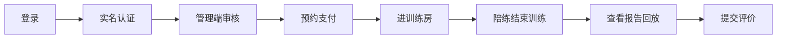
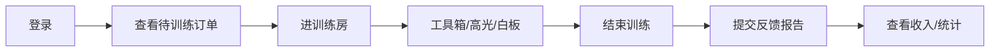
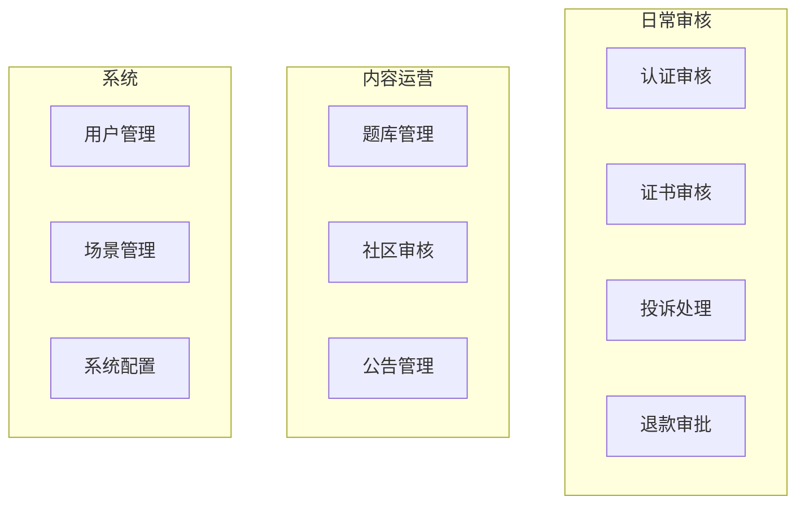

# 语境智练 · 项目运行说明书

> 本文档说明如何在本地/演示环境**启动项目**，以及**学员端、陪练端、管理端**的完整使用流程。  
> 面向：测试、演示、新成员上手、课程答辩展示。

---

## 目录

1. [运行前准备](#1-运行前准备)
2. [统一登录与三端入口](#2-统一登录与三端入口)
3. [学员端使用流程](#3-学员端使用流程)
4. [陪练端使用流程](#4-陪练端使用流程)
5. [管理端使用流程](#5-管理端使用流程)
6. [跨端联合演示（推荐剧本）](#6-跨端联合演示推荐剧本)
7. [配图说明](#7-配图说明)
8. [常见问题](#8-常见问题)

---

## 1. 运行前准备

### 1.1 环境要求

| 依赖 | 版本建议 |
|------|----------|
| JDK | 17+ |
| Maven | 3.8+ |
| Node.js | 18+ |
| MySQL | 8.0（库名 `context_practice`） |
| Redis | 本地运行，建议设密码 |

### 1.2 后端配置与启动

```bash
cd ContextPractice-backend
copy .env.example .env    # 填入 MySQL / Redis / TRTC 等（开发可只填数据库）
mvn spring-boot:run
```

启动成功后访问：**http://localhost:8080**

> Flyway 会自动执行数据库迁移（V1–V11），首次启动需确保 MySQL 已创建空库 `context_practice`。

### 1.3 三端前端启动

在**三个终端**分别执行：

```bash
# 终端 A：学员端 H5
cd ContextPractice-frontend
npm install
npm run dev:h5
# → http://localhost:5173

# 终端 B：陪练端
cd ContextPractice-coach
npm install
npm run dev
# → http://localhost:5175

# 终端 C：管理端
cd ContextPractice-frontend
npm run dev:admin
# → http://localhost:5176
```

### 1.4 端口一览

| 服务 | 地址 | 说明 |
|------|------|------|
| 后端 API | http://localhost:8080 | 所有前端 `/api` 代理到此 |
| 学员端 | http://localhost:5173 | uni-app H5 |
| 陪练端 | http://localhost:5175 | 独立 PC Web |
| 管理端 | http://localhost:5176 | admin 子应用 |

> **[配图建议：图 1-1 四窗口联调布局]**  
> 截图桌面同时打开 5173 / 5175 / 5176 三个浏览器标签 + 可选 Postman/终端，标注「先启后端，再启三端」。

### 1.5 演示账号

开发环境短信验证码固定为 **888888**（无需真实短信）。

| 角色 | 手机号 | 用户名 | 说明 |
|------|--------|--------|------|
| 学员 | 13800000001 | demo_user | 主演示学员 |
| 陪练 | 13800000002 | demo_coach | 接单、进房、提交证书 |
| 管理员 | 13800000003 | demo_admin | 审核与运营 |

备用学员（多种子订单）：13800000011~13、13800000021~23。

---

## 2. 统一登录与三端入口

三端共用学员端登录页，通过顶部切换进入不同端。

### 2.1 打开登录页

浏览器访问：

```
http://localhost:5173/#/pages/auth/login
```

也可带参数直达目标端：

| URL 参数 | 效果 |
|----------|------|
| `?side=user` | 默认学员端（登录后进 Tab 首页） |
| `?side=coach` | 陪练端（登录后跳转 5175） |
| `?side=admin` | 管理端（登录后跳转 5176） |

### 2.2 登录步骤（通用）

1. 在登录页顶部选择 **学员端 / 陪练端 / 管理端** 之一。
2. 输入对应演示手机号（见上表）。
3. 点击「获取验证码」→ 输入 **888888**（开发环境页面可能直接提示 dev 码）。
4. 点击「登录」。
5. 系统按角色自动跳转：
   - **学员** → 留在 5173 首页
   - **陪练** → `http://localhost:5175/#/orders?token=...`
   - **管理员** → `http://localhost:5176/#/dashboard?token=...`

> **[配图建议：图 2-1 统一登录页三端切换]**  
> 截取登录页顶部「学员端 / 陪练端 / 管理端」切换区域 + 手机号/验证码表单。

### 2.3 退出登录

| 端 | 操作 |
|----|------|
| 学员端 | 我的 → 设置相关入口，或清除浏览器缓存后访问 `?logout=1` |
| 陪练端 | 侧栏底部退出，或 token 失效后回登录页 |
| 管理端 | 左侧栏底部「退出登录」 |

---

## 3. 学员端使用流程

**访问地址**：http://localhost:5173  
**演示账号**：13800000001 / 888888

底部 Tab：**首页 · 场景 · 实战圈 · 订单 · 我的**

---

### 3.1 流程 A：实名认证（预约前必做）

> 预约专家陪练前需完成实名认证；未认证会弹窗引导。

| 步骤 | 操作 | 页面 |
|------|------|------|
| 1 | Tab「我的」→ 个人看板 → **身份认证** | `pages/identity-verify` |
| 2 | 填写真实姓名、身份证号（格式校验通过） | 步骤 1 |
| 3 | 上传身份证人像面、国徽面 | 步骤 2 |
| 4 | 点击「提交审核」 | 状态变为「审核中」 |
| 5 | 等待管理端审核（见 [5.2](#52-流程-b实名认证审核)） | — |
| 6 | 审核通过后刷新「我的」或重新进入认证页 | 显示「已通过实名认证」 |

> **[配图建议：图 3-1 学员实名认证三步]**  
> 拼图：基础信息 → 证件上传 → 审核结果。

---

### 3.2 流程 B：预约陪练并支付

| 步骤 | 操作 | 页面 |
|------|------|------|
| 1 | Tab「场景」浏览六大场景，或 Tab「首页」进入陪练大厅 | `pages/scenes` / 首页入口 |
| 2 | 选择场景 → **陪练大厅** 筛选陪练，或 **专家预约** 选具体陪练 | `coach-hall` / `expert-booking` |
| 3 | 选择可约时段，确认场景与陪练信息 | 预约页 |
| 4 | 若未实名认证，按提示先完成 [流程 A](#31-流程-a实名认证预约前必做) | — |
| 5 | 提交订单 → **去支付**（开发环境为模拟支付） | 订单/checkout |
| 6 | 支付成功 → Tab「订单」查看，状态为 **待训练** | `pages/my-orders` |

> **[配图建议：图 3-2 专家预约与支付]**  
> 时段选择 + 订单列表「待训练」状态。

---

### 3.3 流程 C：进入训练房间（1v1 音视频）

| 步骤 | 操作 | 说明 |
|------|------|------|
| 1 | Tab「订单」→ 找到 **待训练/训练中** 订单 | — |
| 2 | 在预约开始前 **5 分钟内** 点击 **「进入训练房间」** | 过早进房可能被拒绝 |
| 3 | 授权摄像头、麦克风 | 浏览器需 HTTPS 或 localhost |
| 4 | 等待陪练进房；双方到齐后开始训练 | TRTC 实时音视频 |
| 5 | 训练中可使用：聊天、白板、压力提问（陪练发起）等 | 学员 mainly 应答 |
| 6 | **陪练点击结束训练** 后房间关闭 | 学员不可自行结束 |

> 双人进房后，后端自动触发 **云录制**（需 TRTC 配置完整；否则为演示回放）。

> **[配图建议：图 3-3 学员训练房间]**  
> 本地/远端双画面 + 底部工具栏。

---

### 3.4 流程 D：查看报告与评价

| 步骤 | 操作 | 页面 |
|------|------|------|
| 1 | 训练结束后，订单状态变为 **报告已生成** 或类似 | Tab「订单」 |
| 2 | 点击进入 **反馈报告** | `pages/report-detail` |
| 3 | 查看：五维雷达、专家反馈、**交互式录像回放**、成长时间线 | 报告组件 |
| 4 | 可选：提交训练评价 | `pages/post-training-review` |
| 5 | Tab「我的」→ 最近报告 / 成长曲线 | 个人看板 |

> **[配图建议：图 3-4 反馈报告与录像回放]**  
> 雷达图 + 视频时间轴打点。

---

### 3.5 流程 E：练习实验室（无需下单）

| 步骤 | 操作 | 页面 |
|------|------|------|
| 1 | 从首页或场景入口进入 **练习实验室** | `pages/practice-lab` |
| 2 | **题库练习**：按场景/压力题分类刷题 | 需管理端已配置题库 |
| 3 | **录音自测**：本地录音 + 语速等分析 | VoicePractice |
| 4 | **文稿优化**：粘贴稿子获取 AI 优化建议 | 需 AI 密钥配置 |

---

### 3.6 流程 F：实战圈（社区）

| 步骤 | 操作 | 页面 |
|------|------|------|
| 1 | Tab「实战圈」 | `pages/insight-square` |
| 2 | 浏览心得 / 高光 / 面经帖子 | 社区流 |
| 3 | 点赞、评论 | 需登录 |
| 4 | 发帖（若开放） | 管理端可审核下架 |

---

### 3.7 流程 G：投诉与退款

| 步骤 | 操作 | 页面 |
|------|------|------|
| 1 | 订单详情或帮助入口 → **投诉** | `pages/complaint` |
| 2 | 填写投诉内容并提交 | 管理端 [5.4](#54-流程-d投诉处理) 处理 |
| 3 | 符合条件订单可申请 **退款** | 订单操作 → 管理端 [5.5](#55-流程-e退款审批) 审批 |

---

### 3.8 学员端流程总览



---

## 4. 陪练端使用流程

**访问地址**：http://localhost:5175  
**演示账号**：13800000002 / 888888（也可从 5173 登录页选「陪练端」自动跳转）

侧栏菜单：**订单工作台 · 排班设置 · 训练历史 · 收入明细 · 数据统计 · 个人主页 · 资质认证**

---

### 4.1 流程 A：处理订单并进房

| 步骤 | 操作 | 页面 |
|------|------|------|
| 1 | 登录后默认进入 **订单工作台** | `/orders` |
| 2 | 查看统计：待训练 / 训练中 / 已完成 | 顶部卡片 |
| 3 | 切换 Tab：**待训练** → 找到学员已支付的订单 | — |
| 4 | 点击订单卡片进入 **订单详情** | `/orders/:id` |
| 5 | 在预约时段前 **5 分钟** 内点击 **「进入训练房间」** | 跳转 `/room/:roomId` |
| 6 | 若学员尚未进房，可能显示「等待学员开始」 | 需学员先发起进房 |
| 7 | 双方进房后开始对练 | TRTC |

> **[配图建议：图 4-1 陪练订单工作台]**  
> 待训练/训练中 Tab +「进入训练房间」按钮。

---

### 4.2 流程 B：训练房操作

| 步骤 | 操作 | 说明 |
|------|------|------|
| 1 | 确认音视频正常 | 全屏训练页 |
| 2 | **工具箱**：发起压力提问、展示题目 | CoachToolbox |
| 3 | **捕捉高光**：标记学员精彩片段 | 写入训练笔记，报告可展示 |
| 4 | **白板**：协作书写 | WhiteboardPanel |
| 5 | **上传资料**：训练参考资料 | 学员端可查看 |
| 6 | 训练结束点击 **「结束训练」** | 仅陪练可结束；触发录制停止与报告生成 |

> **[配图建议：图 4-2 陪练训练房工具箱]**  
> 高光、压力提问、白板、结束训练按钮特写。

---

### 4.3 流程 C：提交课后反馈

| 步骤 | 操作 | 页面 |
|------|------|------|
| 1 | 训练结束后，从订单详情或历史进入 | `/orders/:id` 或 `/history` |
| 2 | 点击 **提交反馈报告** | `/submit-feedback/:orderId` |
| 3 | 填写结构化评分与文字反馈 | 表单 |
| 4 | 提交后学员可在报告页查看 | — |

---

### 4.4 流程 D：排班与收入

| 步骤 | 操作 | 页面 |
|------|------|------|
| 1 | 侧栏 **排班设置** | `/schedule` |
| 2 | 配置每周可预约时段模板 | 学员预约时可见 |
| 3 | 侧栏 **收入明细** | `/income` |
| 4 | 查看本月收入、历史结算 | — |

---

### 4.5 流程 E：资质证书（供管理端审核）

| 步骤 | 操作 | 页面 |
|------|------|------|
| 1 | 侧栏 **资质认证** | `/certificates` |
| 2 | 上传学信网/比赛证书，填写验证码或说明 | 表单 |
| 3 | 提交后状态为待审 | 管理端 [5.3](#53-流程-c证书审核) 处理 |

---

### 4.6 流程 F：数据统计

| 步骤 | 操作 | 页面 |
|------|------|------|
| 1 | 侧栏 **数据统计** | `/dashboard` |
| 2 | 查看：总场次、时长、好评率、等级进度 | 看板 |
| 3 | 若有最近训练，可查看 **录制亮点** 与回放链接 | 需云录制成功 |

---

### 4.7 陪练端流程总览



---

## 5. 管理端使用流程

**访问地址**：http://localhost:5176  
**演示账号**：13800000003 / 888888（须 ADMIN 角色；学员/陪练账号登录会 403）

左侧菜单共 13 项，以下按**运营日常顺序**说明。

---

### 5.1 流程 A：登录与概览

| 步骤 | 操作 |
|------|------|
| 1 | 5173 登录页选 **管理端** → 13800000003 / 888888 |
| 2 | 自动跳转 5176 **概览** `/dashboard` |
| 3 | 查看待审认证、投诉、退款等汇总数字 |

> **[配图建议：图 5-1 管理端概览 Dashboard]**  
> 统计卡片 + 左侧完整菜单。

---

### 5.2 流程 B：实名认证审核

| 步骤 | 操作 | 页面 |
|------|------|------|
| 1 | 侧栏 **认证审核** | `/verifications` |
| 2 | 分段选择：**pending / approved / rejected** | 默认待审 |
| 3 | 在 pending 列表找到学员提交（如 userId=1） | 含 JSON 证件信息 |
| 4 | 点击 **通过** 或 **驳回**（驳回需填原因） | — |
| 5 | 成功提示后记录从 pending 消失 | 出现在 approved |
| 6 | 学员端重新打开「身份认证」或「我的」→ 显示已认证 | 学员 13800000001 |

**注意**：须使用 **demo_admin**；审核失败时查看页面错误提示（勿忽略假成功）。

---

### 5.3 流程 C：证书审核

| 步骤 | 操作 | 页面 |
|------|------|------|
| 1 | 陪练端先 [提交证书](#45-流程-e资质证书供管理端审核) | — |
| 2 | 侧栏 **证书审核** | `/certificates` |
| 3 | 待审列表 → **通过** / **驳回** | — |

---

### 5.4 流程 D：投诉处理

| 步骤 | 操作 | 页面 |
|------|------|------|
| 1 | 学员端 [提交投诉](#37-流程-g投诉与退款) 后 | — |
| 2 | 侧栏 **投诉处理** | `/complaints` |
| 3 | 筛选 pending → 查看详情 | — |
| 4 | **结案**：标记 RESOLVED 等，填写处理说明 | — |

---

### 5.5 流程 E：退款审批

| 步骤 | 操作 | 页面 |
|------|------|------|
| 1 | 学员申请退款后 | — |
| 2 | 侧栏 **退款审批** | `/refunds` |
| 3 | 待审列表 → **同意** / **拒绝** | 影响订单与支付状态 |

---

### 5.6 流程 F：题库管理

| 步骤 | 操作 | 页面 |
|------|------|------|
| 1 | 侧栏 **题库管理** | `/question-banks` |
| 2 | 按场景筛选题库列表（种子数据已有 6 个场景题库） | — |
| 3 | **新建题库**：选场景、名称、分类（如 pressure） | 对话框 |
| 4 | 点击某题库行 → 下方 **题目列表** | — |
| 5 | **添加题目**：题干、难度、标签 | — |
| 6 | **上架/下架** 题库或题目 | 学员练习实验室同步生效 |

> **[配图建议：图 5-2 题库管理]**  
> 题库表 + 展开的题目列表 + 新建对话框。

---

### 5.7 流程 G：社区内容审核

| 步骤 | 操作 | 页面 |
|------|------|------|
| 1 | 侧栏 **社区内容** | `/community` |
| 2 | 按状态/关键词筛选帖子 | — |
| 3 | **通过 / 下架** 违规内容 | — |

---

### 5.8 流程 H：其他管理功能（简表）

| 菜单 | 典型操作 |
|------|----------|
| 用户管理 | 搜索用户、冻结/解冻 |
| 订单监控 | 按状态查看全平台订单 |
| 场景管理 | 六大场景上下架 |
| 公告管理 | 新建/编辑/删除公告 |
| 系统配置 | 修改 key-value 配置项 |
| 审计日志 | 查看管理员操作记录 |

---

### 5.9 管理端流程总览



---

## 6. 跨端联合演示（推荐剧本）

以下剧本适合答辩或验收，建议 **4 个浏览器窗口** 同时打开。

### 剧本 1：实名认证闭环（约 5 分钟）

| 顺序 | 端 | 操作 |
|------|-----|------|
| 1 | 学员 5173 | 13800000001 登录 → 身份认证 → 提交 |
| 2 | 管理 5176 | 13800000003 登录 → 认证审核 → 通过 |
| 3 | 学员 5173 | 刷新「我的」→ 显示已认证 |

---

### 剧本 2：完整训练闭环（约 15 分钟）

| 顺序 | 端 | 操作 |
|------|-----|------|
| 1 | 学员 | 已完成认证 → 预约 demo_coach → 支付 |
| 2 | 陪练 5175 | 13800000002 登录 → 待训练订单 → 进房 |
| 3 | 学员 | 订单 → 进入训练房间 |
| 4 | 双方 | 对练 2–3 分钟；陪练使用高光/压力题 |
| 5 | 陪练 | 结束训练 → 提交反馈报告 |
| 6 | 学员 | 订单 → 查看报告与录像回放 |
| 7 | 学员 | 提交训练评价 |

---

### 剧本 3：题库 + 练习（约 5 分钟）

| 顺序 | 端 | 操作 |
|------|-----|------|
| 1 | 管理 | 题库管理 → 添加压力题 |
| 2 | 学员 | 练习实验室 → 题库练习 → 看到新题 |

---

### 剧本 4：证书 + 投诉（约 8 分钟）

| 顺序 | 端 | 操作 |
|------|-----|------|
| 1 | 陪练 | 资质认证 → 上传证书 |
| 2 | 管理 | 证书审核 → 通过 |
| 3 | 学员 | 对已完成订单发起投诉 |
| 4 | 管理 | 投诉处理 → 结案 |

> **[配图建议：图 6-1 四端同屏演示]**  
> 答辩现场四窗口布局：学员左、陪练右、管理下、可选投影报告页。

---

## 7. 配图说明

将截图放入 `docs/assets/runbook/`，在 Markdown 中引用：

```markdown

```

| 图号 | 建议文件名 | 拍摄内容 |
|------|------------|----------|
| 图 1-1 | `local-four-ports.png` | 8080+5173+5175+5176 联调 |
| 图 2-1 | `login-three-sides.png` | 登录页三端切换 |
| 图 3-1 | `student-verify-steps.png` | 实名认证三步 |
| 图 3-2 | `student-booking-pay.png` | 预约与支付 |
| 图 3-3 | `student-room.png` | 学员训练房 |
| 图 3-4 | `student-report.png` | 反馈报告回放 |
| 图 4-1 | `coach-orders.png` | 陪练订单台 |
| 图 4-2 | `coach-room-tools.png` | 陪练工具箱 |
| 图 5-1 | `admin-dashboard.png` | 管理概览 |
| 图 5-2 | `admin-question-banks.png` | 题库管理 |
| 图 6-1 | `demo-four-windows.png` | 答辩四窗口布局 |

---

## 8. 常见问题

| 现象 | 原因 | 处理 |
|------|------|------|
| 管理端操作无效果 | 前端请求未带 method/body | 确认已更新 `admin/src/api/request.ts` 并重启 5176 |
| 认证审核提示成功但学员未变 | 审核未真正入库 / 学员账号不一致 | 确认审的是 **userId=1**；学员用 **13800000001** 登录 |
| 学员仍显示旧认证状态 | 本地缓存 | 退出重登，或清除 `ctx_auth_verify_status` |
| 进房按钮灰色 | 未到提前 5 分钟窗口 | 改种子订单时间或等到时段内 |
| 陪练显示「等待学员开始」 | 学员未先进房 | 学员端订单先点「进入训练房间」 |
| 报告无录像 | 云录制未配置或回调未到 | 配置 TRTC + 公网回调；开发期可能有演示 MP4 |
| 管理端 403 | 非 admin 账号 | 必须用 13800000003 |
| 后端启动失败 Flyway | 迁移 SQL 错误 | 查日志；修复后清理 `flyway_schema_history` 失败行 |
| 验证码错误 | 未用 dev 固定码 | 开发环境用 **888888** |

---

## 附录：快速命令备忘

```bash
# 后端
cd ContextPractice-backend && mvn spring-boot:run

# 学员
cd ContextPractice-frontend && npm run dev:h5

# 陪练
cd ContextPractice-coach && npm run dev

# 管理
cd ContextPractice-frontend && npm run dev:admin
```

---

*运行说明随版本迭代更新；界面文案以实际页面为准。*
